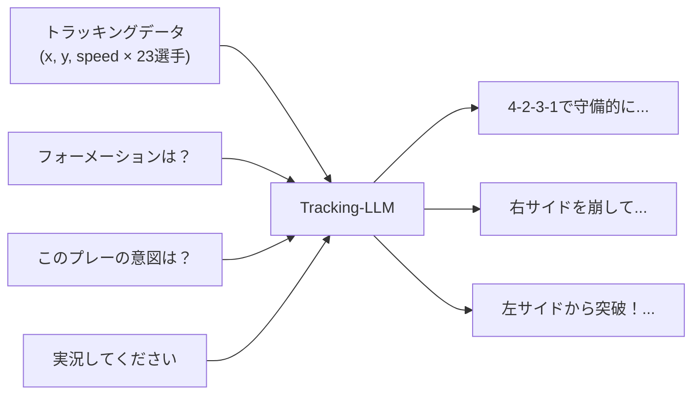
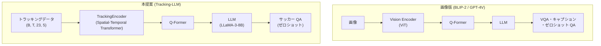
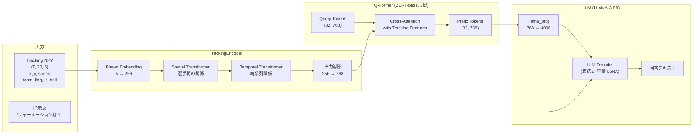
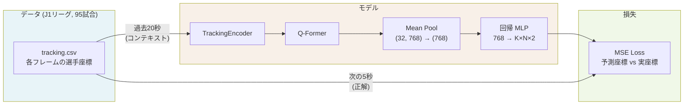
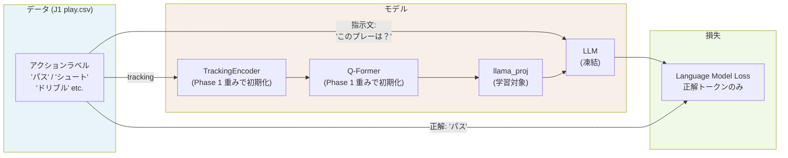
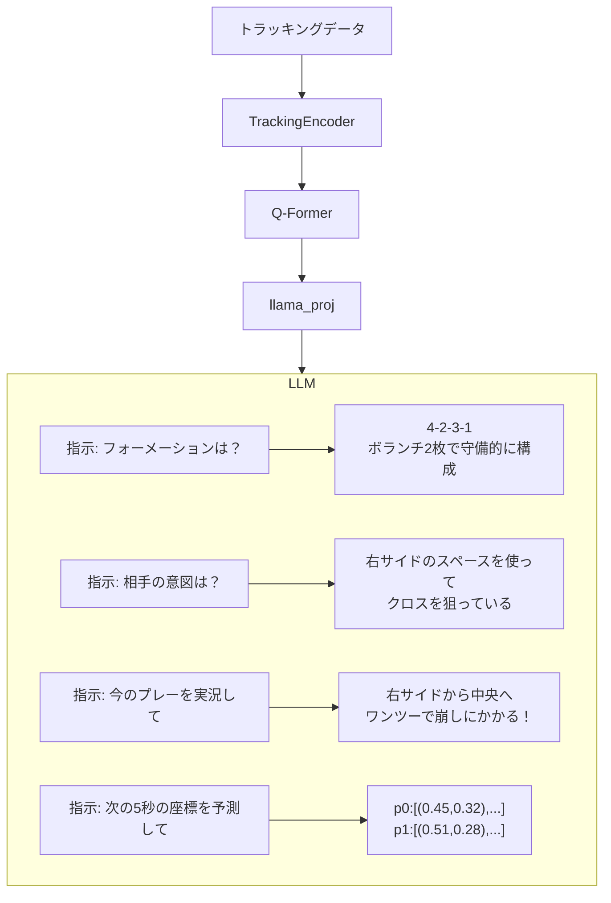

# Tracking-LLM: トラッキングデータによるサッカーマルチタスク QA

## 概要

本研究は、サッカーのトラッキングデータ（選手・ボールの位置情報）を LLM が理解できる表現に変換し、**指示文を切り替えるだけでフォーメーション認識・戦術解説・実況生成などのマルチタスク QA を実現する**モデルを提案する。

Claude や GPT-4V が画像について自由に質問に答えられるように、本モデルはトラッキングデータについてゼロショットで QA する。



---

## 動機

### なぜ LLM か？

従来のサッカー AI はタスクごとに専用モデルを学習していた（フォーメーション認識モデル、実況生成モデル、など）。一方、LLM はテキスト・画像・動画を統一的に扱い、**タスクごとのラベルなしにゼロショット QA** を実現している。

本研究はこれをトラッキングデータに拡張する。

| | 従来手法 | 本提案 |
|---|---|---|
| フォーメーション認識 | 専用分類モデル | 指示文を変えるだけ |
| 実況生成 | 専用生成モデル | 指示文を変えるだけ |
| 戦術解説 | 未対応（ラベルがない） | ゼロショット |
| 新タスク追加 | 再学習が必要 | 追加学習不要 |

### BLIP-2 との類比



**鍵となる洞察**: LLM はすでにサッカーの知識（フォーメーション・戦術・ルール）を持っている。必要なのは「トラッキングトークンを LLM が読める形に変換する alignment」のみ。

---

## アーキテクチャ



### 各コンポーネントの役割

| コンポーネント | 役割 | パラメータ数 |
|---|---|---|
| TrackingEncoder | 位置情報 → 時空間特徴 | ~1M |
| Q-Former | 可変長 tracking → 固定 32 トークン | ~14M |
| llama_proj | Q-Former 次元 → LLM 次元 | ~3M |
| LLM | 指示理解 + 回答生成 | 8B（凍結） |

---

## 学習パイプライン

### Phase 1: 軌跡回帰 Pretraining（自己教師あり）



**目的**: 大量の J1 データで TrackingEncoder + Q-Former に「トラッキングデータの空間的・時間的パターン」を学習させる。ラベル不要。

### Phase 2: LLM Alignment（弱教師あり）



**目的**: tracking トークンと LLM の言語空間を接続する。play.csv の自動抽出ラベルのみ使用（人手アノテーション不要）。

### Phase 3: ゼロショット QA（推論）



---

## データ

| データセット | 試合数 | 内容 | 用途 |
|---|---|---|---|
| J1リーグ tracking (SoccerData) | 95試合 | tracking.csv, play.csv, players.csv | Phase 1 pretraining, Phase 2 alignment |
| SoccerNet tracking | 44クリップ | MOT形式 + 実況テキスト | 補助学習・評価 |
| SoccerReplay-1988 | 1,988クリップ | 映像 + アクションラベル | 補助学習 |

### J1データのフォーマット

```
tracking.csv: GameID, Frame, HA, SysTarget, No, X, Y, Speed
play.csv:     フレーム番号, アクションID, アクション名, 試合状態
players.csv:  ホームアウェイF, 背番号, スタメン
```

---

## 評価

| タスク | メトリクス | データ |
|---|---|---|
| 軌跡予測 | ADE / FDE | J1 test split |
| アクション分類 | Accuracy / F1 | play.csv test split |
| ゼロショット QA | Human eval / BLEU | 手動作成問題セット |

---

## 研究上の貢献

1. **新モダリティの LLM 統合**: トラッキングデータ（時系列座標）を LLM が扱える最初のフレームワーク
2. **自己教師あり pretraining**: 軌跡回帰により大量のラベルなしデータを活用
3. **ゼロショット マルチタスク**: 単一モデルで指示文を変えるだけで複数タスクに対応
4. **実用性**: 実際の J1 データで検証

---

## 実装状況

- [x] TrackingEncoder（Spatial-Temporal Transformer）
- [x] Q-Former + LLM パイプライン（matchvoice_model_tracking）
- [x] SoccerData 前処理スクリプト（preprocess_soccerdata.py）
- [x] 軌跡回帰モデル（TrajectoryRegressionModel）
- [x] 軌跡回帰学習スクリプト（train_trajectory_regression.py）
- [ ] play.csv を使った alignment 学習
- [ ] ゼロショット QA 評価スクリプト
- [ ] フォーメーション自動ラベリング
